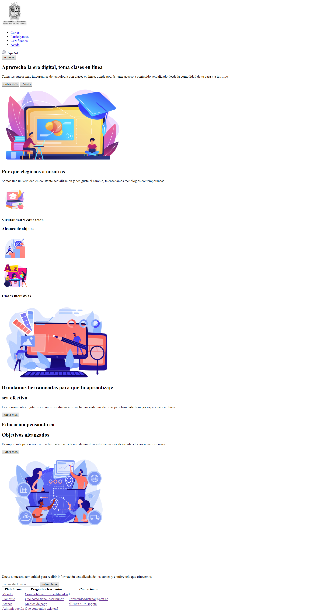
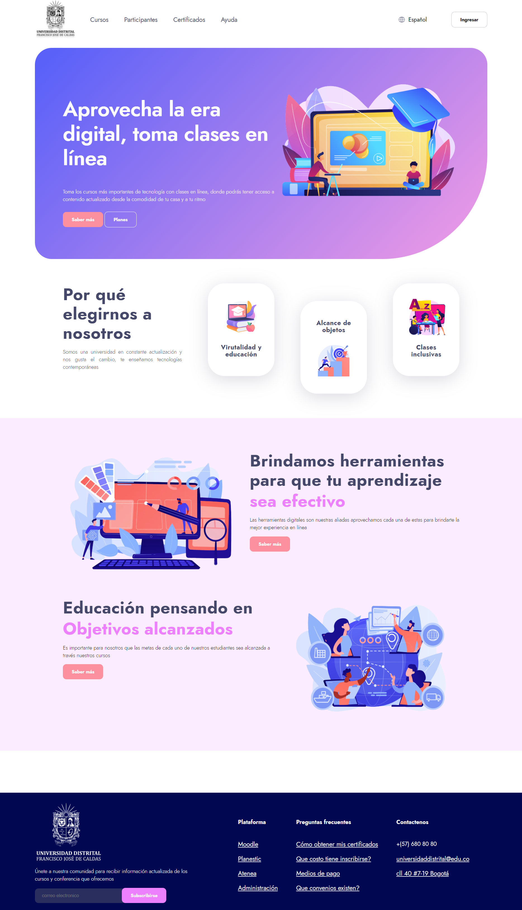
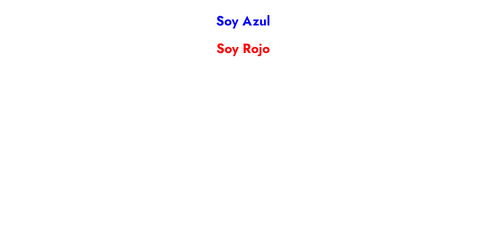
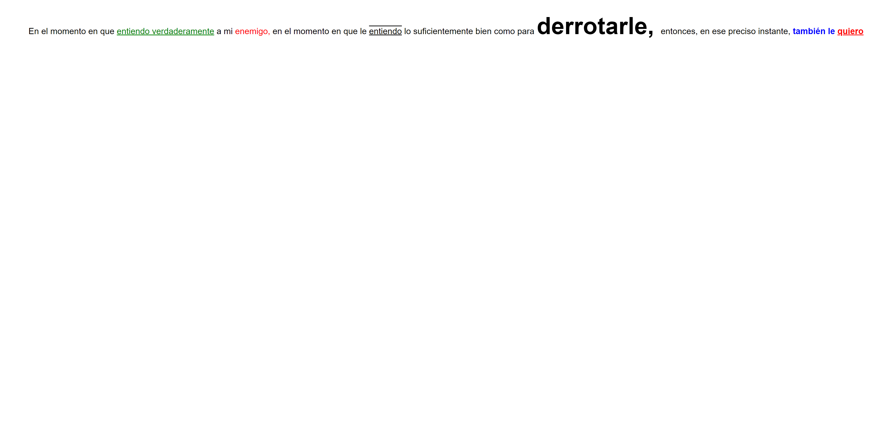
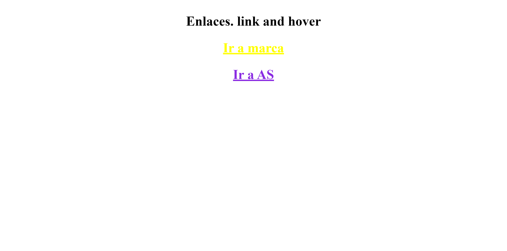
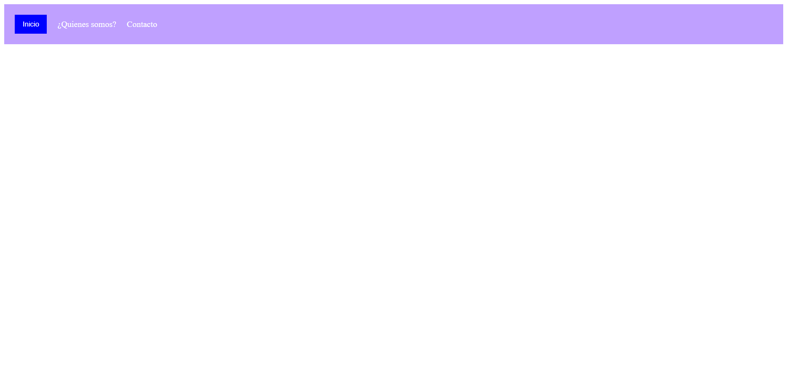
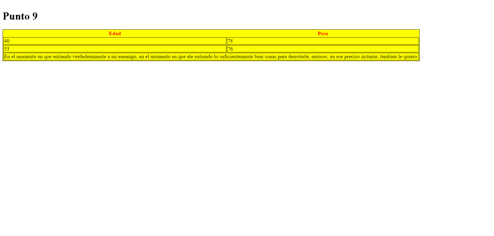

<h1>Workshop Unit 9</h1>

Course: Basic Full Stack

Instructor: Cristian Patiño

<h2>Task 1: Figma Link</h2>
<a href="https://www.figma.com/file/ZTZImpFpCFX9p1xrn64Jc5/Untitled?type=design&node-id=0%3A1&mode=design&t=aDws3MCSo4E8Ggts-1" target="__blank">Figma Link</a>
 
<a href="https://full-stack-curse.vercel.app/">Page Link</a>
<h2>Task 2: HTML</h2>

  

<h2>Task 3: CSS</h2>

  

<h2>Task 4: Text in the Browser</h2>

  

<h2>Task 5: Paragraph</h2>

  

<h2>Task 6: Links</h2>

  

<h2>Task 7-8: Menu</h2>

  

<h2>Task 9: Table</h2>

  

